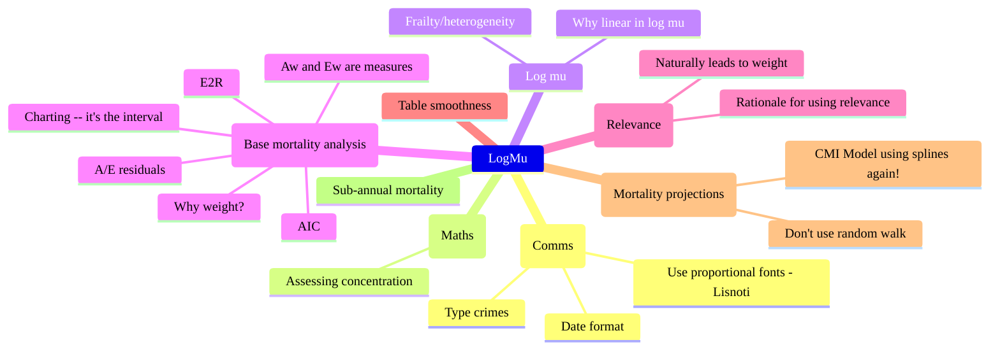

# README-BLOG PLAN

<!--
#00A0C0
#FF3300
-->

## Summary

- [ ] Measures matter -- laying the foundations for mortality experience analaysis (E2R, mortality, A and E)
- [ ] A over E
- [ ] Log-likelihood of mortality experience 
- [ ] Why proportional hazards is canonical
- [ ] Suddenly AIC
- [ ] The relevance of relevance
- [ ] Good things come to those who weight
- [ ] How to show A/E
- [ ] Gompertz rules
- [ ] Frailty and heterogeneity
- [ ] The shape of mortality (SE == time?)
- [ ] I will always log mu
- [ ] The importance of being smooth
- [ ] ARI process and Whitaker-Henderson
- [ ] Don't take a random walk
- [ ] Representing continuous time
- [ ] The one true date format
- [ ] Measuring concentration -- don't summon the Gini
- [ ] Sub-annual mortality
- [ ] Log SMR
- [ ] CMI Model using splines again!
- [ ] Behavioural patterns in forecasting
- [ ] Type crimes
- [ ] PV-impact relevance
- [ ] Time-based relevance

## Planned blog posts

1. **Presentation**

   - [x] (2024-01-23) Lisnoti -- A proportional font that works for coding too|

1. **Commentary**

   - [x] (2024-10-10) Richards & al -- On contemporary mortality models for actuarial use|

1. **CT mortality experience**

   - [ ] **E2R, mortality and A/E** (consider providing separate glossary that we add to)
    - Continuous time in practice means base mortality -- simply don't have this data on time scales for mortality projection models
    - Extol continuous time (although noting that ironically simulating reals is a bad way to do this in practice)
    - Not pure maths technical -- we want to get to the interesting bits -- but we do want a clear foundation
    - Some things people seem to be unaware
    - There will be some controversy, anecdotes and -- I think -- some surprises along the way (unless you've worked with me)
    - E2R and the 'experience space'
      - Formally, space is function of $i,t$, caglad(!) in $t$
        - We'll call these *variables*
        - Check this is Richards and Macdonald's definition for their indicator
      - $\text{d}\varepsilon$ means infinitesimal exposure of individual $i$ for interval $\text{d}t$ with an indicator for what happened at the end of that interval, i.e the triple $(i, \text{d}t, \delta)$
    - We'll drop the $i$ when writing infinitesimal elements of exposure, but understand that $\text{d}\varepsilon$ implies $(i, [t,t+\text{d}t),\delta)$
    - Richards & Macdonald I think are driving at the same thing but with clunky expression
    - Key points is E2R is [measurable space](https://en.wikipedia.org/wiki/Measurable_space), i.e. we can make sense of $\text{d}\varepsilon$.
    - By assumption,
        - no duplicates (i.e. E2R for same individual at overlapping times),
        - dies once
        - no exposure on or after death

   - [ ] **A and E**
    - Define $\text{A}$ and $E^\mu$
    - Note that $\mu$
      - is caglad(!!) function of $i,t$
    - Mathematically they are measures on the experience space, although I prefer linear operator on functions on experience space -- what matters is that they are generalised linear sums of functions on experience space
    - $E$ is not mathematical expectation
       - We denote mathematical expectation by $\mathbb{E}$
       - We will call $E$ *expected deaths* because that is what actuaries call it in practice
       - $E$ is the limiting canonical form for calculations on grids
       - Lost of confusion about this
    - Notation
       - See [here](https://math.stackexchange.com/questions/5230/is-there-any-difference-between-the-notations-int-fxd-mux-and-int-fx) for notation -- e.g. we could write e.g. $\int_\mathcal{D}fA(\text{d}\varepsilon)$ and $\int_\mathcal{D}fE(\text{d}\varepsilon)$
       - When $\mu$ is clear from context, we'll drop it
       - When $\mathcal{D}$ is clear from context, we'll drop it
    - Because $\text{A}$, $\text{E}$ and $\text{L}$ are measures, we can apply them to any function.
       - You can apply them to an indicator caglad(!!) function
       - Use an indicator if you like to capture the notion of subsets -- I think Richards & Macdonald so this -- but I think it's better to capture this in the definition of the experience data (and that is the only practical approach when we come to implementation)
       - We'll always work with a weight -- we'll come to weights in due course, but if it helps, consider the weight as 0 or 1 (while noting that that the maths works for any integrable function of time)
    - Getting back to expectation, these are two important results *if $\mu$ is the true mortality rate* and  any(!) $f$
       1. $\mathbb{E}(A-E)f=0$
       1. $\text{Var}(Af-Ef)=\mathbb{E}Ef^2$
    - Re the first, stress that even if you fitted your model by lives, this should hold true for amounts
      - This is a good test of your model
      - Note that amounts automatically is unbiased in the presence of multiple policies (although var will be wrong) -- this provides some protection against otherwise undetectable failed duplication
    - Re the second note
      - overdispersion matters -- we will come back to this
      - var is greater for 

   - [ ] **Log-likelihood**
      - $\text{L}$ is a (signed) measure defined as $\text{L}(\text{d}\varepsilon)=\text{A}(\text{d}\varepsilon)\log\mu-\text{E}(\text{d}\varepsilon)$
      - Because $\text{A}$, $\text{E}$ and $\text{L}$ are measures, we can apply them to any function.
      - In practice, we'll use log-likelihood as a function of a parameter vector, $\beta$, i.e. $L(\beta)=\text{A}w\log\mu(\beta)-\text{E}^{\mu(\beta)}w$ rather than a signed measure, with $w$ and $\beta$ implied by context

   - [ ] **Proportional hazards**
    - Consider $\mu$ as a function of a vector of parameters $\beta$
    - Proportional hazards is canonical
    - $L'(\hat\beta) =0\iff\big(\text{A}-\text{E}\big)\mu'/\mu=0$ so set $X=\mu'/\mu$ and require $X$ indep of $\beta$, i.e. $X'=0$
    - $-L''(\text{d}\varepsilon) =XX^\text{T}\text{E}(\text{d}\varepsilon)$
    - $\mathbb{E}L'(\text{d}\varepsilon)L'(\text{d}\varepsilon)^\text{T} =\mathbb{E}XX^\text{T}\text{E}(\text{d}\varepsilon)$
    - Note that fitting weighted by $f$ *ensures* that $\mathbb{E}(A-E)f=0$, which suggests you pick the weight that matters
    - Linear -- see I will always log mu article

   - [ ] **Suddenly AIC**
   - Derive AIC at high level
   - $L_\text{P}=L(\hat\beta)-\text{tr}(L''/\mathbb{E}L'L'^\text{T})$

   - [ ] **How to show A/E**
   - [ ] A/E charts -- *It's the interval stupid*
   - Definition of confidence intervals -- Bayes vs frequentist pedantry
   - Use 100%, not plot e.g. on age scale (and not with lots of points)

   - [ ] **Good things come to those who weight  (Part I)**
   - Why weight?
     - This is a topic in itself
     - Within a frame where all data is true, lives-weighted is correct, but we will come back to this in a later article
     - Like to Bayes vs frequentist pedantry dogma or 1TB
     - Note that there are scenarios where both fail
     - Test is which would you choose, A/E on lives or amounts?
     - Note that amounts does not suffer from de-duplication issue (but suffers from others)
     - Amounts v lives continues because they are (relatively) well-defined
   - Tell story of consultant whose process introduced bias for this reason
   - PV matters too -- link to relevance
   - Rationale for using relevance
     - Meta
     - Binary 0/1 cut off is odd
     - Weights do not make sense if all data considered is 100% reliable -- but no-one believes this

   - [ ] **Good things come to those who weight  (Part II)**
   - Naturally leads to weight

1. **CT Mortality**

   - [ ] Why linear in log mu -- *I will always log mu*
   - [ ] Frailty/heterogeneity
   - Plainly real, but widely ignored
   - Does heterogeneity imply higher PV?
   - Implies Perks
   - More general than gamma
   - Dynamic is equivalent to static!
   - [ ] Shape variation (SE = time?)
   - [ ] Table smoothness
   - Rationale
   - $\log\mu$ vs $\mu$

1. **Whitaker-Henderson**
   - [ ] Whitaker v Einstein
   - You have the original paper!
   - Special and general
   - Every few years, some gets excited at thinking they've uncovered the Bayesian interpretation
   - Note that WH probable pre-dates Whitaker (ironically)
   - [ ] Use with AIC -- weighting is not arbitrary
   - [ ] Relation to ARI - NB true matrix
   - [ ] Fat-tailed version
   - [ ] Pro/cons
   - If there is lots of data (e.g. population mortality) then does the extra complexity serve a useful purpose
   - Note that CMI simply rescaled data to get similar results to E&W
   - Quote Richards to smooth or not to smooth -- all the same thing in WH

1. **Projections**
   - [ ] Don't use random walk
   - [ ] CMI Model using splines again!
   - [ ] Sub-annual mortality

1. **Implementation**
   - [ ] Representing time
   - Use fixed precision -- associative, well-defined
   - [ ] Use SIMD for integration

1. **Comms**
   - [ ] Use proportional fonts - Lisnoti
   - [ ] *Type crimes*
   - [ ] Date format
   - XKCD cartoon

1. **Maths**
   - [ ] Assessing concentration -- *Don't summon the Gini*

1. **Forecasting**
   - [ ] Tetlock
   - Things predicted that didn't happen at time of writing that then did
   - Same experience of arguing over the rules when wrong
   - Psychology of changing minds

||Use the correct characters|•&#xA0;Hyphen is not minus (and neither is en dash) •&#xA0;'x' is not times •&#xA0;use curly quotes (and single ones if you're English) •&#xA0;Even the BBC gets this wrong|
||CT Mortality -- Plan|•&#xA0;Canonical (more than once!) •&#xA0;Log-likelihood &amp; KL •&#xA0;What does 'fit' mean for actuaries? •&#xA0;Smoothness •&#xA0;Relevance and weighted log-likelihood -- you'll be surprised!|
||CT Mortality -- Definitions|•&#xA0;**Consider making this a technical appendix** •&#xA0;E2R =  $(\nu,\tau,\delta)$ = measurable space •&#xA0;CT, i.e. infinitely fine mesh is canonical •&#xA0;$f(i,t)\ge0$ is caglad in $t$ for formal but there are better ways for computing, so smooth for real world •&#xA0;Mortality is $\mu(i,t)\gt0$ •&#xA0;We'll defer meaning of $f$ -- treat like indicator if it makes you happy for the time being •&#xA0;Af and Ef are *measures* •&#xA0;Notation -- drop $i$ and $t$
||CT Mortality -- A over E|•&#xA0;$\text{A}f$ and $\text{E}f$ are rvs •&#xA0;For *true* $\mu$, $\mathbb{E}\text{A}f=\mathbb{E}\text{E}f$ and $\text{Var}(\text{A}f-\text{E}f)=\mathbb{E}\text{E}f^2$
||

||Category|Idea|Notes|
|:---|:---|:---|:---|
|:cinema: |Presentation|Use the correct characters|• Hyphen is not minus (and neither is en dash) • 'x' is not times • Use curly quotes (and single ones if you're English) • Agnostic on no space + em dash vs space + en dash + space|
|:dart: |Actuarial|Weighted mortality framework|• General args • General theory up to AIC|
|:dart: |Actuarial|A/E residuals|• $\text{A}w/\text{E}w$ • Log vs abs scale and residuals • Charting -- does the dot mislead?|
|:dart: |Actuarial|Table smoothness|• Theory -- $\tau$ • Examples from CMI and other base tables / projections (incl AG) • Explain why this matters for the stability of mortality projection *and* allowing for sub-annual variation • Call to action|
|:dart: |Actuarial|What's wrong with a random walk?|• Why you shouldn't use a random walk for a mortality table • You can't adjust for a specific portfolio (because the projections jump off the final points) • Show with a worked example • Secondary is that the future is featureless|
|:dart: |Actuarial|Sub-annual mortality|• Distinction between smooth underlying trend and annual/sub-annual noise • Simple model • Note flaw with Rothesay approach (i.e. tied to annual, must use smooth for projecting base tables) • Provide a TS/WASM implementation|
|:dart: |Actuarial|PV-impact relevance|• Weaknesses of simple amounts-based approach • Relevance and other approaches to fixing for this (while maintaining the benefits)|
|:dart: |Actuarial|Time-based relevance|• Annual noise vs relevance • Standard rules of thumb • How to capture the notion that experience data becomes less relevant with time|
|:dart: |Actuarial|Mortality heterogeneity|• Frailty theory • Equivalence of static and dynamic theory • Constraints on tables|
|:dart: |Actuarial|Log SMR|• Value and its uncertainty • Normal approximation for log SMR vs Poisson? • Tool to access log SMR on demand using HMD plus local TS/WASM|
|:heavy_division_sign: |Maths/stats|Equivalence of ARI and Whittaker-Henderson |• Maths • Matrix form for ARI processes • Simple for difference processes • Pro and cons -- noting that multiple ARI= ARIMA|
|:heavy_division_sign: |Maths/stats|Using the W matrix|• Motivation • Illustration|
|:heavy_division_sign: |Maths/stats|Assessing concentration|• Simple methods vs e.g. Gini coefficient • Application for actuarial work|
|:bug: |Coding|Language design|
|:bug: |Coding|Fast $q$-scaling of $\mu$ vectors|• Pade approximations • Specific considerations for scaling $\mu$ in age order (i.e. increasing magnitude)|

## Mortality topics

1. **Shape**
   - [ ] Why linear in log mu -- *I will always log mu*
   - [ ] Frailty/heterogeneity
   - Plainly real, but widely ignored
   - Does heterogeneity imply higher PV?
   - Implies Perks
   - More general than gamma
   - Dynamic is equivalent to static!
   - [ ] Shape variation (SE = time?)
   - [ ] Table smoothness
   - Rationale
   - $\log\mu$ vs $\mu$

1. **Whitaker-Henderson**
   - [ ] Whitaker v Einstein
   - You have the original paper!
   - Special and general
   - Every few years, some gets excited at thinking they've uncovered the Bayesian interpretation
   - Note that WH probable pre-dates Whitaker (ironically)
   - [ ] Use with AIC -- weighting is not arbitrary
   - [ ] Relation to ARI - NB true matrix
   - [ ] Fat-tailed version
   - [ ] Pro/cons
   - If there is lots of data (e.g. population mortality) then does the extra complexity serve a useful purpose
   - Note that CMI simply rescaled data to get similar results to E&W
   - Quote Richards to smooth or not to smooth -- all the same thing in WH

1. **Analysing mortality experience**

   1. **E2R and mortality**
      - Continuous time in practice means base mortality -- simply don't have this data on time scales for mortality projection models
      - Extol continuous time (although noting that ironically simulating reals is a bad way to do this in practice)
      - Not pure maths technical -- we want to get to the interesting bits -- but we do want a clear foundation
      - Some things people seem to be unaware
      - There will be some controversy, anecdotes and -- I think -- some surprises along the way (unless you've worked with me)
      - E2R and the 'experience space'
        - space is function of $i,t$, cadlag in $t$
          - We'll call these *variables*
          - Check this is Richards and Macdonald's definition for their indicator
        - $\text{d}\varepsilon$ means infinitesimal exposure of individual $i$ for interval $\text{d}t$ with an indicator for what happened at the end of that interval, i.e the triple $(i, \text{d}t, \delta)$
      - We'll drop the $i$ when writing infinitesimal elements of exposure, but understand that $\text{d}\varepsilon$ implies $(i, [t,t+\text{d}t),\delta)$
      - Richards & Macdonald I think are driving at the same thing but with clunky expression
      - Key points is E2R is [measurable space](https://en.wikipedia.org/wiki/Measurable_space), i.e. we can make sense of $\text{d}\varepsilon$.
      - By assumption,
          - no duplicates (i.e. E2R for same individual at overlapping times),
          - dies once
          - no exposure on or after death

   1. **A and E**
      - Define $\text{A}$ and $E^\mu$
      - Note that $\mu$
        - is cadlag function of $i,t$
      - Mathematically they are measures on the experience space, although I prefer linear operator on functions on experience space -- what matters is that they are generalised linear sums of functions on experience space
      - $E$ is not mathematical expectation
         - We denote mathematical expectation by $\mathbb{E}$
         - We will call $E$ *expected deaths* because that is what actuaries call it in practice
         - $E$ is the limiting canonical form for calculations on grids
         - Lost of confusion about this
      - Notation
         - See [here](https://math.stackexchange.com/questions/5230/is-there-any-difference-between-the-notations-int-fxd-mux-and-int-fx) for notation -- e.g. we could write e.g. $\int_\mathcal{D}fA(\text{d}\varepsilon)$ and $\int_\mathcal{D}fE(\text{d}\varepsilon)$
         - When $\mu$ is clear from context, we'll drop it
         - When $\mathcal{D}$ is clear from context, we'll drop it
      - $\text{L}$ is a (signed) measure defined as $\text{L}(\text{d}\varepsilon)=\text{A}(\text{d}\varepsilon)\log\mu-\text{E}(\text{d}\varepsilon)$
      - Because $\text{A}$, $\text{E}$ and $\text{L}$ are measures, we can apply them to any function.
         - You can apply them to an indicator cadlag function
         - Use an indicator if you like to capture the notion of subsets -- I think Richards & Macdonald so this -- but I think it's better to capture this in the definition of the experience data (and that is the only practical approach when we come to implementation)
         - We'll always work with a weight -- we'll come to weights in due course, but if it helps, consider the weight as 0 or 1 (while noting that that the maths works for any integrable function of time)
      - Getting back to expectation, these are two important results *if $\mu$ is the true mortality rate* and  any(!) $f$
         1. $\mathbb{E}(A-E)f=0$
         1. $\text{Var}(Af-Ef)=\mathbb{E}Ef^2$
      - Re the first, stress that even if you fitted your model by lives, this should hold true for amounts
        - This is a good test of your model
        - Note that amounts automatically is unbiased in the presence of multiple policies (although var will be wrong) -- this provides some protection against otherwise undetectable failed duplication
      - Re the second note
        - overdispersion matters -- we will come back to this
        - var is greater for 
      - In practice, we'll use log-likelihood as a function of a parameter vector, $\beta$, i.e. $L(\beta)=\text{A}w\log\mu(\beta)-\text{E}^{\mu(\beta)}w$ rather than a signed measure, with $w$ and $\beta$ implied by context

   1. **Proportional hazards**

      - Proportional hazards is canonical
      - $L'(\hat\beta) =0\iff\big(\text{A}-\text{E}\big)\mu'/\mu=0$ so set $X=\mu'/\mu$ and require $X$ indep of $\beta$, i.e. $X'=0$
      - $-L''(\text{d}\varepsilon) =XX^\text{T}\text{E}(\text{d}\varepsilon)$
      - $\mathbb{E}L'(\text{d}\varepsilon)L'(\text{d}\varepsilon)^\text{T} =\mathbb{E}XX^\text{T}\text{E}(\text{d}\varepsilon)$
      - Linear -- see I will always log mu article

   1. **Suddenly AIC**

      - Derive AIC at high level

   - [ ] A/E residuals
   - [ ] A/E charts -- *It's the interval stupid*
   - Definition of confidence intervals -- Bayes vs frequentist pedantry
   - Use 100%, not plot e.g. on age scale (and not with lots of points)

   - [ ] Why weight? -- *Good things come to those who weight (Part I)*
   - This is a topic in itself
   - Within a frame where all data is true, lives-weighted is correct, but we will come back to this in a later article
   - Like to Bayes vs frequentist pedantry dogma or 1TB
   - Note that there are scenarios where both fail
   - Test is which would you choose, A/E on lives or amounts?
   - Note that amounts does not suffer from de-duplication issue (but suffers from others)
   - Tell story of consultant whose process introduced bias for this reason
   - [ ] Model selection part I
   - PV matters too -- link to relevance

1. **Relevance**
   - [ ] Rationale for using relevance
   - [ ] Naturally leads to weight -- *Good things come to those who weight (Part II)*
   - [ ] Applications in practice
   - Amounts v lives continues because they are (relatively) well-defined
   - Suggested standards

1. **Projections**
   - [ ] Don't use random walk
   - [ ] CMI Model using splines again!
   - [ ] Sub-annual mortality

1. **Implementation**
   - [ ] Representing time
   - Use fixed precision -- associative, well-defined
   - [ ] Use SIMD for integration

## Other topics

1. **Comms**
   - [ ] Use proportional fonts - Lisnoti
   - [ ] *Type crimes*
   - [ ] Date format
   - XKCD cartoon

1. **Maths**
   - [ ] Assessing concentration -- *Don't summon the Gini*

1. **Forecasting**
   - [ ] Tetlock
   - Things predicted that didn't happen at time of writing that then did
   - Same experience of arguing over the rules when wrong
   - Psychology of changing minds

## Thought map

/