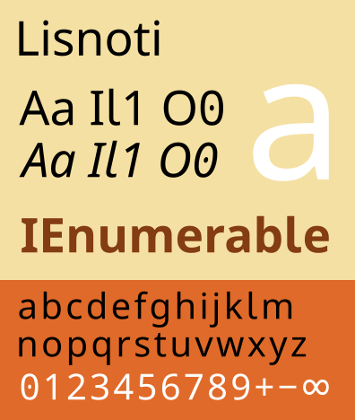

# Lisnoti – a proportional font that works for coding too

{ align=right }

Over the past 15 years or so, I have periodically searched in vain for a *proportional* sans serif font that is both high quality in itself but also suitable for programming, i.e. writing computer code. I finally decided to stop waiting and to make one myself.

The result is [Lisnoti](https://github.com/Lisnoti/Lisnoti/) (`/lɪzˈnəʊtiː/`), which is published under the [SIL Open Font Licence (OFL)](https://openfontlicense.org/) and can be downloaded [here](https://github.com/Lisnoti/Lisnoti/). It is also the font used to typeset this blog.

<!-- more -->

## The most extreme typewriter habit of them all

It's a curious thing that almost no-one other than coders uses [monospaced fonts](https://en.wikipedia.org/wiki/Monospaced_font) for large amounts of text. Proportional fonts are ubiquitous for the simple reason that characters such as `W` and `i` have very different natural widths. Trying to squash `W` and widen `i` so that they have same width is at best inefficient and at worst less readable. And this is before we consider non-Western languages that use characters that are wider still.

The convention that monospaced fonts are used for coding derives from programming's historical reliance on (a)&nbsp;typewriter-like terminals and displays, and (b)&nbsp;the ASCII character set (or similar), which can just about be crammed into a fixed width font.

!!! info inline end "'Typewriter habits'"

    'Typewriter habits' is a term coined by Matthew Butterick in his excellent [Practical Typography](https://practicaltypography.com/typewriter-habits.html) to describe bad typography habits left over from the typewriter era.

The case for using proportional fonts for coding -- essentially readability and efficiency -- has already been well made by [Martijn Storck](https://storck.io/posts/proportional-programming-code-fonts/), [Nelson Minar](https://nelsonslog.wordpress.com/2021/09/12/proportional-fonts-and-yapf-vs-black/) and [David Jonathan Ross](https://input.djr.com/info/). But the sheer prevalence of monospaced fonts in coding contexts means that their use is often just taken for granted and so the habit is hard to break, despite widespread IDE support for proportional fonts and despite computing having spread far beyond the English-speaking world (hello Unicode).

Sometimes monospace is precisely what you want (e.g. to edit hex data, write assembly or use a terminal). But many objections to proportional fonts boil down to monospaced fonts being presumed to be better simply because either

- people are used to them, or
- some -- arguably brittle and source diff-unfriendly -- code alignment practices, such as hanging comments, assume that the code will always be displayed using a monospaced font.

If you're completely unconvinced about using proportional fonts for coding then fine; this article is not for you.

If, on the other hand, you are interested then there is one common objection to proportional fonts that does need to be addressed, which is that many (sans serif) fonts *do not reliably distinguish between characters that matter when writing code*. (In contrast, almost all monospaced fonts do.) So let's tackle this first.

## The A1 AI called Al

I am going to focus on *sans serif* fonts because I think these are overall clearer for coding than serif fonts (e.g. [Times New Roman](https://en.wikipedia.org/wiki/Times_New_Roman)).

The most obvious problem when using sans serif fonts for coding is distinguishing

- upper case `I` from lower case `l` (and while we're here, also the number `1`), and
- upper case `O` from zero `0`. 

For instance, Gill Sans () has the classic purist design where `I`, `l` and `1` are indistinguishable.

Many sans serif fonts do at least distinguish the number `1` from letters, e.g Roboto ( -- Arial and Calibri are similar). But this still leaves `I` and `l` easily confused. 

!!! info inline end "Legibility is a wider concern"

    The need to distinguish similar-looking characters such as `I` v `l` is not just a coding issue -- see e.g. [this Linotype article](https://www.linotype.com/6990/din-1450.html) on redesigning Frutiger to comply with German legibility standard DIN 1450.

    You may find it surprising that, many typefaces commonly used for -- sometimes even *specifically designed for* -- public signage do not reliably distinguish between the letters `I` and `l`. (You can probably spot a few in [this summary](https://en.wikipedia.org/wiki/List_of_public_signage_typefaces).)
    
    Notable historical exceptions include the pioneering London Underground [Johnston typeface](https://en.wikipedia.org/wiki/Johnston_(typeface)), the UK's [Transport typeface](https://en.wikipedia.org/wiki/Transport_(typeface)) and Germany's [DIN 1451](https://en.wikipedia.org/wiki/DIN_1451).

To address the `I` v `l` issue, modern fonts often follow in the footsteps of Johnston (see the boxout) and put a tail on the lower case `l`. Unfortunately, there is an alternative convention whereby the lower case `l` remains tailless and instead serifs are added to the upper case `I`. An example of this inconsistency is the `I` and `l` typography in Google's [Noto global fonts project](https://fonts.google.com/noto) where

- the [Japanese version of Noto Sans](https://fonts.google.com/noto/specimen/Noto+Sans+JP) uses the first convention (), but

- the [Western version of Noto Sans](https://fonts.google.com/noto/specimen/Noto+Sans) uses the second convention ().

What this means is that, *even if `I` is distinct from `l` within a font, you cannot deduce which is which in isolation*, plus there is additional cognitive load.

Back at the start of 2017, Paul McAulay asked that [Noto Sans and Roboto be modified to correct precisely this ambiguity](https://github.com/notofonts/noto-fonts/issues/821#issuecomment-270531619) (see [here for the Roboto request](https://github.com/googlefonts/roboto/issues/226)), but he and others were given pretty short shrift. The objection that I really struggle to understand is that *making `I` and `l` distinct cannot be done for style reasons* -- see for example [this classic ('it just won't fit')](https://github.com/googlefonts/roboto/issues/226#issuecomment-270854413) and, in relation to a different font,
 [a dismissal based solely on style ('differentiation is not a design goal')](https://github.com/be5invis/Iosevka/issues/1352#issuecomment-1125731246).

A limited few proportional fonts *do* handle the `I` v `l` issue:

- David Jonathan Ross's proportionally-spaced sans serif variant on his [Input font](https://input.djr.com/info/) does this by design, although I find it too clunky for general typography (which to be fair is not what it is intended for).
- I suspect [IBM Plex](https://www.ibm.com/plex/) achieves this accidentally solely because of the `I` in the IBM logo.

But fixing the `I` v `l` issue is just the start&nbsp;…

## The long wish list

As well as being suitable for writing standard computer code and as a general font, I'd also like a font that includes mathematical and other symbols that crop up in code documentation and, if you use [Julia](https://julialang.org/), in actual code.

The reason you want all characters in the *same* font is that otherwise the environment you're using will either show a meaningless replacement character (e.g. `�`) or make a -- likely garish -- substitution from an unrelated font.

!!! info inline end "Hyphen vs minus sign"

    Using hyphen to represent a minus sign is a frequently-occurring typographical sin, the more so because almost all modern fonts specifically include an actual minus sign (`U+2212`).

    Even the generally reliable Matthew Butterick lapses (albeit while advocating the use of true maths symbols) [by suggesting en dash as a minus sign](https://practicaltypography.com/math-symbols.html) -- please don't do that!

    Even professional typographers screw this up. At time of writing, [Noto Sans](https://fonts.google.com/noto/specimen/Noto+Sans) *does* implement the Unicode minus sign but does so *incorrectly* as a hyphen. (The minus sign in the font file is literally a reference to the hyphen glyph.)

Here's my personal long list of font requirements and character coverage:

1. Reliable distinction of `I`/`l` and `O`/`0` (as already discussed).

1. Consistent arithmetic, comparison, logic, set, *n*-ary and other common mathematical operators and entities, e.g. 

    - arithmetic: `− × ÷ ± ∓ ∞`
    - comparison: `≤ ≠ ≥ ≈ ≡ ≢ ∝`
    - logic: `¬ ∧ ∨ ⊻ ⊤ ⊥ ⊦`
    - set: `∩ ∪ ∈ ∉ ⊂ ⊃ ⊆ ⊇ ∅`
    - *n*-ary: `∑ ∏ ⋀ ⋁  ⋂ ⋃`
    - other: `∫ ∂ √ Δ  ∇ ∀ ∃`

1. Greek and Cyrillic letters -- mathematics and logic make frequent use of Greek letters and occasionally Cyrillic ones too.

1. Consistently formatted digit and Roman letter superscripts and subscripts, e.g. `¹²³⁽⁾⁺⁻ ᵃᵇᶜ ᴬᴮᴰ` and `₁₂₃₍₎₊₋ ₐₑₕ`.

1. A selection of symbols (consistently including all related characters within each set -- I've shown only subsets below)

    - squares, diamonds, rectangles, triangles, circles and stars, e.g.`■ ◇ ▮ △ ● ☆`
    - arrows, e.g. `→ ⇒ ⇨ ￫`
    - ticks and crosses, e.g. `☑ ✔✕✘`
    - box drawing, e.g.`│ ┐ ┬ ├`
    - game characters, e.g.`♚♕♠♡`
    - miscellaneous but useful, e.g. `☸ ♯ ⌘ ␣`

1. All the operators [parsed by Julia](https://github.com/JuliaLang/julia/blob/master/src/julia-parser.scm).

1. [Unicode mathematical alphanumeric symbols](https://en.wikipedia.org/wiki/Mathematical_Alphanumeric_Symbols), e.g. `𝐀𝐴𝑨 𝒜𝒲𝓐 𝔄 𝔸 𝕬 𝖠𝗔𝘈𝘼 𝙰` (noting that these too can be parsed by Julia).

!!! info "All the above *but monospaced*"

    If you want all the above but you're happy with a monospaced font, then I suggest you check out [Julia Mono](https://juliamono.netlify.app/).

## Introducing the Lisnoti font

Google's [Noto global fonts project](https://fonts.google.com/noto/) has generated sets of sans serif fonts that, in combination, have excellent Unicode coverage and are published under an [open source licence](https://openfontlicense.org/). This means that we can build on the huge amount of technically skilled typographical work that has already been done and publish the results for general use (provided original copyright statements, reserved font name declarations and the original licence text are included).

So that's what I've done -- I've edited and combined Noto Sans fonts to create a proportional font **Lisnoti** (`/lɪzˈnəʊtiː/`) that meets all the requirement listed in this article, including, of course, fixing the ambiguous characters we kicked off with ().

Lisnoti can be downloaded from GitHub **[here](https://github.com/Lisnoti/Lisnoti)** (where you can also find further detail on its construction). 

It is available 

- in regular, *italic*, **bold** and ***bold-italic*** variants,
- in OpenType (`.ttf`) and web (`.woff` and `.woff2`) formats, and

is published under the [SIL Open Font Licence (OFL)](https://openfontlicense.org/). 

I've been using Lisnoti in Visual Studio and VS Code for some time now, and it works for me. (It's been used on Windows and Apple, but not on Linux.)

If you have comments on Lisnoti, please use the [Lisnoti GitHub discussions page](https://github.com/Lisnoti/Lisnoti/discussions). If you do comment then please bear in mind that I am not a typography expert, just a frustrated user.

Cheers